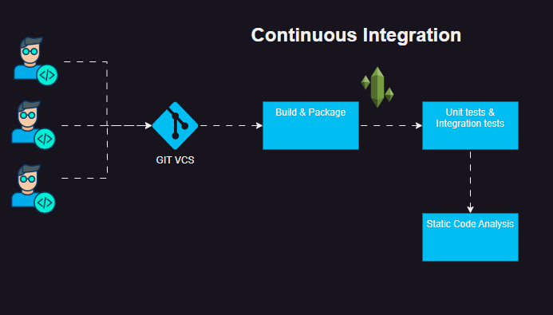
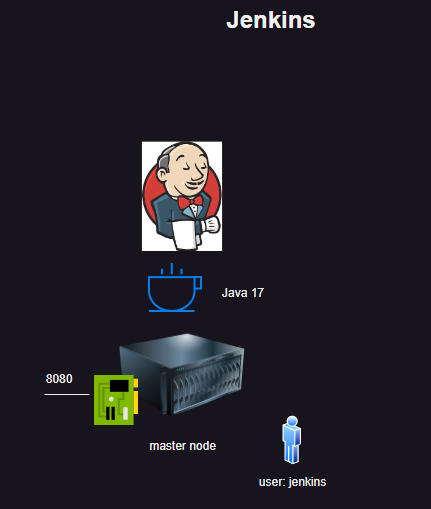
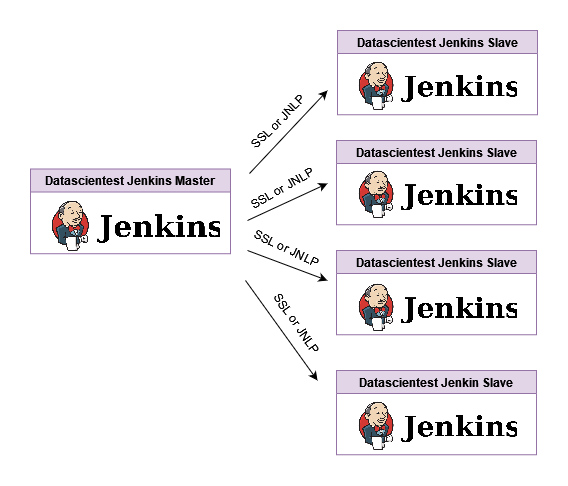
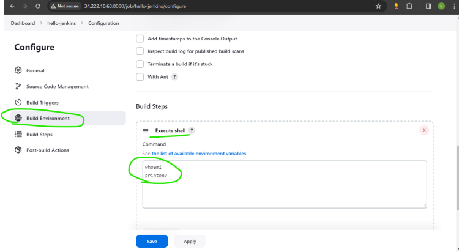
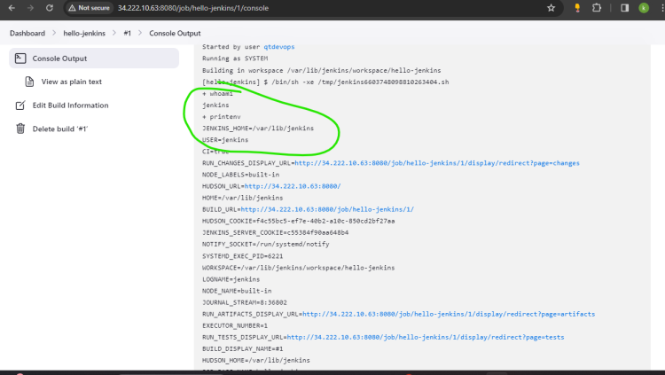
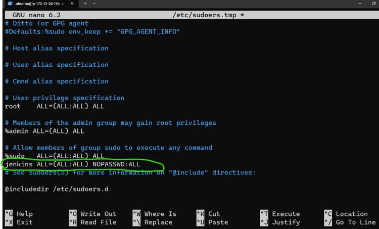
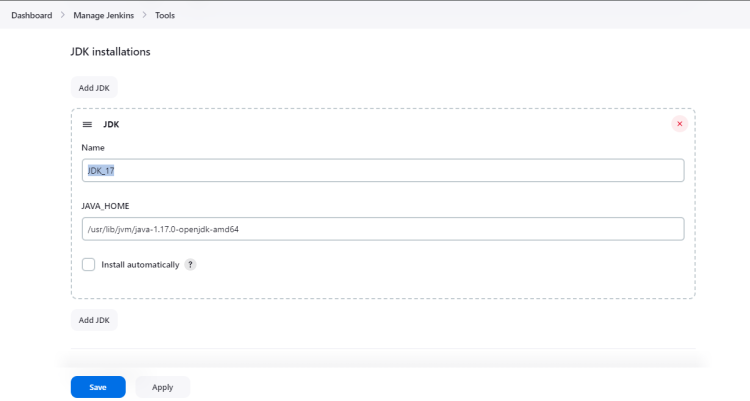
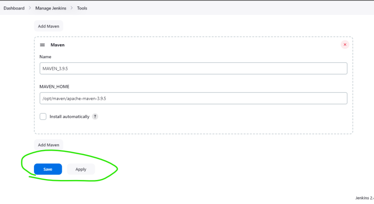
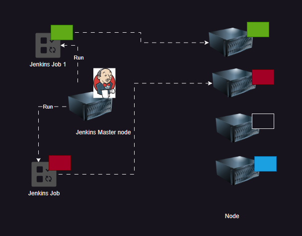
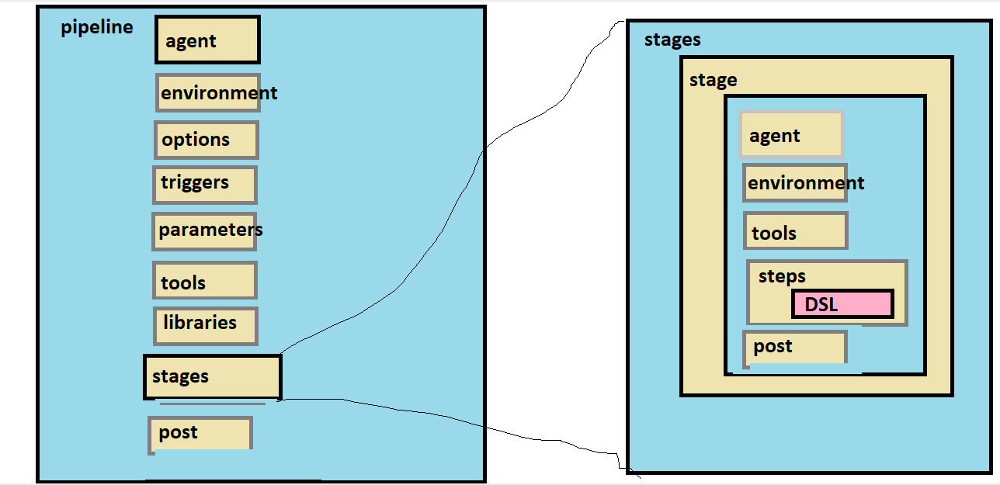

## Before jenkins

* software delivery process is manual and time consuming due to that we all face following challenges:
  
  * Long release cycles
  * High chances of human errors
  * Difficult to track changes
* so that to overcome these challenges we use ci/cd tools like jenkins,gitlab ci etc

## Jenkins installation

* refer here: <https://www.jenkins.io/doc/book/installing/linux/#debianubuntu>
* Install jdk 17

```bash
sudo apt update
sudo apt install openjdk-17-jdk -y
```

* Add Jenkins repository and key

```bash
sudo wget -O /usr/share/keyrings/jenkins-keyring.asc \
  https://pkg.jenkins.io/debian-stable/jenkins.io-2023.key
echo deb [signed-by=/usr/share/keyrings/jenkins-keyring.asc] \
  https://pkg.jenkins.io/debian-stable binary/ | sudo tee \
  /etc/apt/sources.list.d/jenkins.list > /dev/null
sudo apt update
sudo apt install jenkins -y
```

* Start and enable Jenkins service

```bash
sudo systemctl start jenkins
sudo systemctl enable jenkins
```

* Jenkins runs on port:8080 by default
* Once we install jenkins a user called as jenkins is created
* Navigate to http://<public-ip>:8080
* Enter the initialAdmin password
* sudo cat /var/lib/jenkins/secrets/initialAdminPassword
* Install selected plugins
* Create a admin user
* [alt text](Images/jenkins61.webp)

## CI/CD Engine

* The idea of CI is to give feedback to developer about his recent change
* Steps: Whenever developer submits the code to git (push/pull request)
  * Build the code
  * Package the code
  * Execute the automated tests (unit tests/integration tests)
  * Run the static code analysis
  * 
  * At any step if there is a failure, developer is supposed to rework i.e. his work is rejected.
  * To perform this we need a software which can call the steps mentioned above. This software is called as CI/CD Engines
  * Now lets look at a popular CI/CD Engine
        * Jenkins
  
## Jenkins

* Jenkins is an open-source automation server written in Java.
* It is used to automate the building, testing, and deployment of software projects.
* Jenkins supports a wide range of plugins for various tools and technologies.
  
## Jenkins Architecture

* Jenkins follows a master-slave architecture.
* The master node is responsible for managing the Jenkins environment, including scheduling jobs, monitoring slave nodes, and handling user requests.
* Slave nodes are used to execute jobs and can be distributed across different machines.
* 

* In Jenkins Single Node on the linux machine a user called as jenkins will be created.
* Anything which we run from jenkins ui will be translated to low level linux commands executed as jenkins user.
* So if we want to run any script from jenkins make sure that jenkins user has permission to execute that script.

## Terms in Jenkins

* Job/Project: This is set of steps configured as one unit (Job/Project)
* Workspace: This is a temporary directory where Jenkins stores files related to a job.
* Jenkins Home: This is home directory for the user jenkins which got created as part of jenkins installation.
* Default on linux /var/lib/jenkins
* Jenkins stores everything in jenkins home directory

## Lets create a Project in Jenkins

Create a jenkins free style project (UI/Classic) which shows the current user and environment variables


## Jenkins workspace

* Every jenkins job has its own workspace
* Workspace is a temporary directory where jenkins stores files related to that job.
* To view the workspace of a job navigate to
  * http://<public-ip>:8080/job/<job-name>/ws/

  
## Building the code, Packaging the code

* In jenkins we can build/package the code by adding build steps in the job configuration
* to build the project we can use tools like maven gradle ant etc for java based projects
* to package the code we can use tools like docker,jar,zip etc
* example: java is a high level language which needs to be compiled to byte code before execution.
* so machine cannot understand java code directly.so it converts it to .class files which is understands by the jvm.
* this process of converting java code to byte code is called as building the code.
* Once the code is built we need to package it to distribute it to end users.
* this process of bundling the built code into distributable format is called as packaging the code.
* example: packaging the built java code into jar/war files.

## Maven

* Maven is a build automation tool used primarily for Java projects.
* It uses a project object model (POM) file to manage project dependencies, build configurations, and plugins.
* Maven simplifies the build process by providing a standardized way to compile, test, and package Java applications.
* It also has a large repository of plugins and libraries that can be easily integrated into projects.
* To install maven on ubuntu:
  
```bash
   sudo apt update && sudo apt install maven -y
   mvn -version
```

# repositories in maven

* Maven uses repositories to manage project dependencies.
* there are three types of repositories in maven
  * local repository:
    * this is a directory on the developer machine where maven stores the downloaded dependencies.
    * default location: ~/.m2/repository
  * central repository:
    * this is a remote repository maintained by the maven community.
    * url: <https://repo.maven.apache.org/maven2>
  * remote repository:
    * these are additional repositories that can be configured in the pom.xml file.
    * these repositories can be hosted by third-party vendors or organizations.
* When a maven build is executed, maven first checks the local repository for the required dependencies.
* If the dependencies are not found in the local repository, maven then checks the central repository
* If the dependencies are not found in the central repository, maven then checks any remote repositories that have been configured in the pom.xml file.
* Once the dependencies are found, maven downloads them to the local repository for future use.
* This process ensures that all required dependencies are available for the project to build and run successfully.

## Goals in maven

* In maven, a goal is a specific task that can be executed as part of the build process.
* Goals are defined by plugins, which are used to extend the functionality of maven.
* Some common goals in maven include:
  * compile: This goal compiles the source code of the project.
  * clean: This goal removes any previously compiled files and directories.
  * validate: This goal checks the project for any errors or inconsistencies.
  * test: This goal runs the unit tests for the project.
  * package: This goal packages the compiled code into a distributable format, such as a JAR or WAR file.
  * install: This goal installs the packaged code into the local repository for use by other projects.
  * deploy: This goal deploys the packaged code to a remote repository for sharing with other developers.

## configure maven in jenkins

* To install maven in jenkins there are two approaches
  * Using Jenkins: Avoid this approach
  * installing maven and configuring in jenkins: This is better approach
* To install softwares we need sudo permissions. Lets give sudo permissions to the jenkins user as we are installing maven on jenkins master node
* Execute sudo visudo or visudo from root user
* Lets install Maven 3.9.5

```bash
   sudo apt update
   sudo apt install wget -y
   wget https://archive.apache.org/dist/maven/maven-3/3.9.5/binaries/apache-maven-3.9.5-bin.tar.gz
   sudo tar -xvzf apache-maven-3.9.5-bin.tar.gz -C /opt/
   sudo ln -s /opt/apache-maven-3.9.5 /opt/maven
   sudo nano /etc/profile.d/maven.sh
```

* Add the below lines to maven.sh file

```bash
   export M2_HOME=/opt/maven
   export PATH=${M2_HOME}/bin:${PATH}
```

* Save and exit
* Make the script executable

```bash
   sudo chmod +x /etc/profile.d/maven.sh
```

* Load the environment variables

```bash
   source /etc/profile.d/maven.sh
   mvn -version
```

* Now configure maven in jenkins
  * Navigate to Manage Jenkins -> Global Tool Configuration -> Maven -> Add Maven
  * Provide name as maven and MAVEN_HOME as /opt/maven
  * Save the configuration



* Tools section in jenkins help in finding tool locations like jdk,maven etc..
* The advantage is we can configure multiple versions of same tool and use them in different jobs

## Environment variables in jenkins

* Jenkins master injects environmental variables with information about various aspects such as
* GIT DETAILS
* BUILD DETAILS
* WORKSPACE DETAILS
* Navigate below for the whole list
* JENKINS_HOME=/var/lib/jenkins
* GIT_PREVIOUS_SUCCESSFUL_COMMIT=c4081c09f8231a44e7d8d898a1ad4476f827da36
* USER=jenkins
* CI=true
* RUN_CHANGES_DISPLAY_URL=<http://34.222.10.63:8080/job/spring-petclinic-daybuild/5/display/redirect?page=changes>
* NODE_LABELS=built-in
* HUDSON_URL=<http://34.222.10.63:8080/>
* GIT_COMMIT=c4081c09f8231a44e7d8d898a1ad4476f827da36
* HOME=/var/lib/jenkins
* BUILD_URL=<http://34.222.10.63:8080/job/spring-petclinic-daybuild/5/>
* HUDSON_COOKIE=29a01ce1-e58d-4b7a-9b23-ae1975c228d1
* JENKINS_SERVER_COOKIE=c55384f90aa648b4
* NOTIFY_SOCKET=/run/systemd/notify
* SYSTEMD_EXEC_PID=375
* WORKSPACE=/var/lib/jenkins/workspace/spring-petclinic-daybuild
* LOGNAME=jenkins
* NODE_NAME=built-in
* JOURNAL_STREAM=8:17665
* RUN_ARTIFACTS_DISPLAY_URL=<http://34.222.10.63:8080/job/spring-petclinic-daybuild/5/display/redirect?page=artifacts>
* EXECUTOR_NUMBER=1
* GIT_BRANCH=origin/main
* RUN_TESTS_DISPLAY_URL=<http://34.222.10.63:8080/job/spring-petclinic-daybuild/5/display/redirect?page=tests>
* BUILD_DISPLAY_NAME=#5
* HUDSON_HOME=/var/lib/jenkins
* JOB_BASE_NAME=spring-petclinic-daybuild
* PATH=/usr/lib/jvm/java-1.17.0-openjdk-amd64/bin:/usr/lib/jvm/java-1.17.0-openjdk-amd64/bin:/usr/local/sbin:/usr/local/bin:/usr/sbin:/   usr/bin:/sbin:/bin:/snap/bin
* INVOCATION_ID=a1556e10e7bb446795e87a1e2a56deca
* BUILD_ID=5
* BUILD_TAG=jenkins-spring-petclinic-daybuild-5
* LANG=C.UTF-8
* JENKINS_URL=<http://34.222.10.63:8080/>
* JOB_URL=<http://34.222.10.63:8080/job/spring-petclnic-daybuild/>
* GIT_URL=<https://github.com/dummyrepos/spring-petclinic-nov23.git>
* BUILD_NUMBER=5
* SHELL=/bin/bash
* RUN_DISPLAY_URL=<http://34.222.10.63:8080/job/spring-petclinic-daybuild/5/display/redirect>
* HUDSON_SERVER_COOKIE=c55384f90aa648b4
* JOB_DISPLAY_URL=<http://34.222.10.63:8080/job/spring-petclinic-daybuild/display/redirect>
* JOB_NAME=spring-petclinic-daybuild
* JAVA_HOME=/usr/lib/jvm/java-1.17.0-openjdk-amd64
* PWD=/var/lib/jenkins/workspace/spring-petclinic-daybuild
* GIT_PREVIOUS_COMMIT=c4081c09f8231a44e7d8d898a1ad4476f827da36
* WORKSPACE_TMP=/var/lib/jenkins/workspace/spring-petclinic-daybuild@tmp

## Executors in Jenkins

* In jenkins every node will have executors.
* The number of parallel projects which you can build depend on number of executors
* Always ensure you terminate the jobs by defining the hard limits of time to keep your executors ready to serve other projects.

## Distributed Builds in jenkins

* Jenkins supports distributed builds, which allows you to run builds on multiple machines.
* This is useful for large projects that require a lot of resources to build.
* To set up distributed builds in jenkins we need to add slave nodes to the jenkins master.
* Slave nodes can be added using ssh or by using jenkins agent.jar file.
* Once the slave nodes are added, we can configure the jobs to run on specific slave nodes.
* This allows us to distribute the load of building projects across multiple machines, which can improve the performance of the build process.
* 
* There are two ways of connecting nodes
  * Linux: By configuring ssh connections
  * Windows: Configure using
    * JNLP
    * Windows Service

## Plugins in jenkins

* Jenkins has a large number of plugins available that can be used to extend its functionality.
* Plugins can be installed from the jenkins plugin manager.
* Some popular plugins include:
* Git plugin: This plugin allows jenkins to integrate with git repositories.
* Maven plugin: This plugin allows jenkins to build maven projects.
* Docker plugin: This plugin allows jenkins to build and deploy docker containers.
* Pipeline plugin: This plugin allows jenkins to create and manage pipelines for continuous integration and delivery

## Pipeline as Code:

* This approach is defining steps required for building CI/CD expressed as a code in version control system.
* Advantages:
* Changes done in pipeline over a period of time will have history in git.
* It also allows to create reusability
* Jenkins started doing Pipeline as code with Scripted Pipelines and then they have also provided Declarative Pipelines
* Scripted Pipeline:
* This is the Pipeline expressed in groovy language.
* These pipelines are very much useful if your CI/CD pipeline has complex steps.
* Declarative Pipeline:
* This pipeline is expressed in the form of Jenkins DSL (Domain Specific Language) which internally uses groovy.
* This has been implemented to reduce the learning curve.
* The Pipeline as Code in Jenkins can be expressed in any file but file with name Jenkinsfile is commonly used.
* refer here for more info: <https://www.jenkins.io/doc/book/pipeline/syntax/>
* refer here for declarative pipeline: <https://www.jenkins.io/doc/book/pipeline/syntax/#declarative-pipeline>
* refer here for scripted pipeline: <https://www.jenkins.io/doc/book/pipeline/syntax/#scripted-pipeline>

## Multibranch Pipelines in Jenkins:

* Multibranch Pipeline is a feature in Jenkins that allows you to automatically create and manage pipelines for multiple branches of a repository.
* This is useful for projects that have multiple branches, such as feature branches, release branches, and hotfix branches.
* With Multibranch Pipeline, Jenkins automatically scans the repository for branches and creates a separate pipeline for each branch.
* Each pipeline can have its own set of steps and configurations, allowing for greater flexibility and customization
* refer here for more info: <https://www.jenkins.io/doc/book/pipeline/multibranch/> 

## Day and Night Builds:

* Day Build: This is the build which is triggered on every code commit.
* Night Build: This is the build which is triggered once in a day generally during night time.
* Night builds are generally more comprehensive than day builds as these builds have more time to execute.
* So night builds generally include integration tests, code analysis, security scans etc
* Day builds generally include unit tests and basic code analysis   
* This approach helps in giving quick feedback to developers during day time and more comprehensive feedback during night time.

## SONARQUBE SCAN in Jenkins

* SonarQube is a popular open-source platform for continuous inspection of code quality.
* It provides static code analysis to detect bugs, code smells, and security vulnerabilities in various programming languages.
* To integrate SonarQube with Jenkins, we can use the SonarQube Scanner plugin.
* Steps to configure SonarQube in Jenkins:
* Install SonarQube Scanner plugin in Jenkins.
* Configure SonarQube server in Jenkins global configuration.
* Create a Jenkins job and add SonarQube analysis as a build step.
* Configure the SonarQube project key and other parameters in the build step.
* Run the Jenkins job to perform SonarQube analysis on the codebase.
* View the SonarQube analysis results in the SonarQube dashboard.
* Refer here for more info: <https://docs.sonarqube.org/latest/analysis/scan/sonarscanner-for-jenkins/>

## Jfrog Artifactory in Jenkins:

* JFrog Artifactory is a popular artifact repository manager that allows you to store and manage your build artifacts.
* To integrate JFrog Artifactory with Jenkins, we can use the JFrog
* Steps to configure JFrog Artifactory in Jenkins:
* Install JFrog Artifactory plugin in Jenkins.
* Configure JFrog Artifactory server in Jenkins global configuration.
* Create a Jenkins job and add JFrog Artifactory as a build step.  
* Configure the JFrog Artifactory repository and other parameters in the build step.
* Run the Jenkins job to upload the build artifacts to JFrog Artifactory.
* View the uploaded artifacts in the JFrog Artifactory dashboard.
* Refer here for more info: <https://www.jfrog.com/confluence/display/JFROG/Jenkins+Artifactory+Plugin>

## Multi node projects

* In jenkins we can create multi node projects to run the jobs on multiple nodes.
* This is useful for large projects that require a lot of resources to build.  
* To create a multi node project in jenkins, we need to configure the job to run on specific slave nodes.
* This allows us to distribute the load of building projects across multiple machines, which can improve the performance of the build process.
* refer here for more info: <https://www.jenkins.io/doc/book/pipeline/multibranch/>
